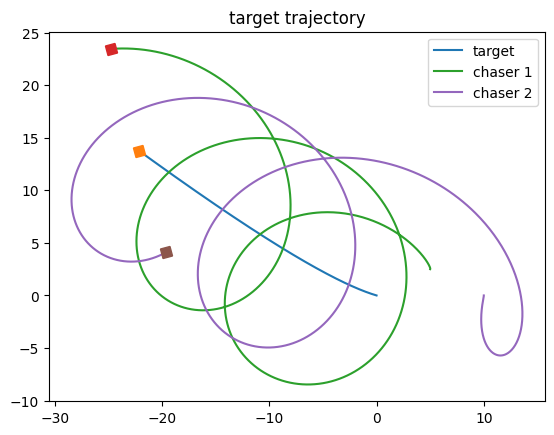

# Close-Range-Rendezvous-with-a-Moving-Target
Close-Range Rendezvous with a Moving Target Spacecraft using Udwadia-Kalaba Equation

@INPROCEEDINGS{8815115,
  author={Pothen, Abin Alex and Ulrich, Steve},
  booktitle={2019 American Control Conference (ACC)}, 
  title={Close-Range Rendezvous with a Moving Target Spacecraft using Udwadia- Kalaba Equation}, 
  year={2019},
  volume={},
  number={},
  pages={3267-3272},
  doi={10.23919/ACC.2019.8815115}}
