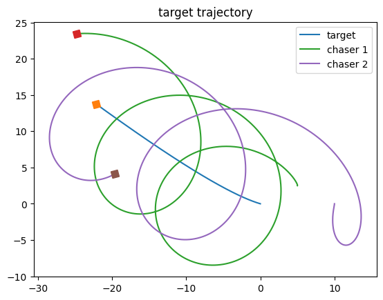

# Close-Range-Rendezvous-with-a-Moving-Target
Close-Range Rendezvous with a Moving Target Spacecraft using Udwadia-Kalaba Equation

## Reference
A. A. Pothen and S. Ulrich, "Close-Range Rendezvous with a Moving Target Spacecraft using Udwadia- Kalaba Equation," 2019 American Control Conference (ACC), Philadelphia, PA, USA, 2019, pp. 3267-3272, doi: 10.23919/ACC.2019.8815115.